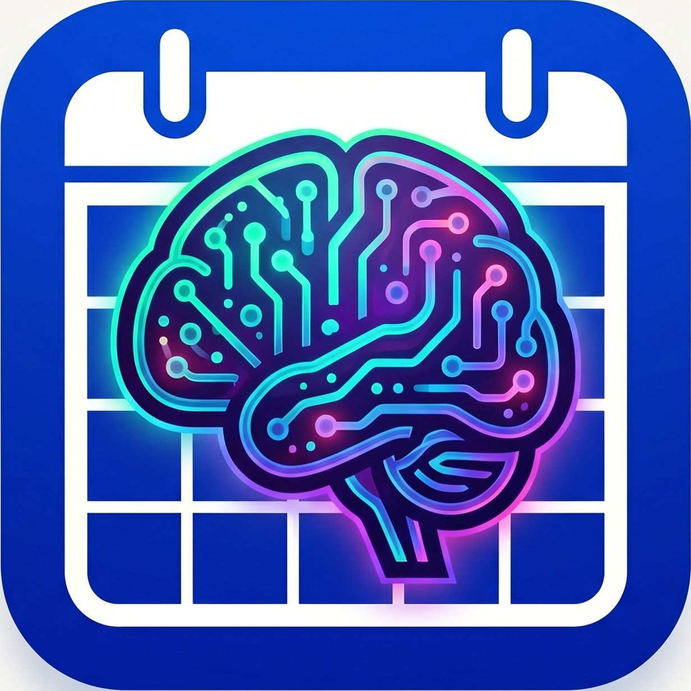
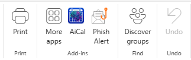
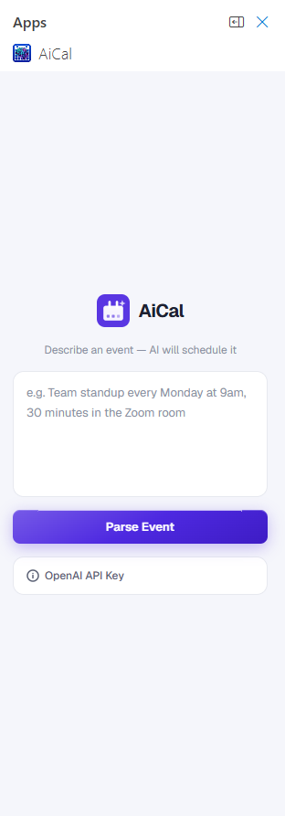

<p align="center">
  
</p>

<h1 align="center">AiCal</h1>

<p align="center">
  An Outlook add-in that turns plain-text descriptions into calendar events — powered by GPT-4o.
</p>

---

## Preview

<p align="center">
  
  &nbsp;&nbsp;&nbsp;
  
</p>

---

## How it works

1. Open any email in Outlook — the **AiCal** button appears in the ribbon
2. Click it to open the side panel
3. Describe your event in plain English — *"Team standup every Monday at 9am for 30 minutes"*
4. GPT-4o parses the details and shows a pre-filled review form you can edit
5. Click **Add to Calendar** to save the event

Supports titles, dates, start/end times, location, notes, and recurring events (daily / weekly / monthly / yearly).

---

## Installation

1. Open the Outlook sideload URL in your browser:

   **https://aka.ms/olksideload**

2. Click **My add-ins** in the left sidebar

3. Scroll to **Custom Add-ins** → **+ Add a custom add-in** → **Add from URL...**

4. Paste this URL:
   ```
   https://we1chj.github.io/AiCal/manifest.xml
   ```

5. Accept the warning — AiCal will appear in your Outlook ribbon

---

## Setup

The add-in requires an OpenAI API key to parse events.

1. Open the add-in in Outlook
2. Expand the **OpenAI API Key** section at the bottom
3. Paste your key (`sk-...`) and click **Save**

Your key is stored locally in the browser and never sent anywhere except the OpenAI API.

---

## Development

```bash
npm install
npm run dev-server
```

To build and deploy to GitHub Pages:

```bash
npm run deploy
```

---

## Tech stack

- [Office.js](https://learn.microsoft.com/en-us/office/dev/add-ins/) — Outlook add-in runtime
- [React](https://react.dev/) + TypeScript
- [OpenAI GPT-4o-mini](https://platform.openai.com/docs) — natural language event parsing
- GitHub Pages — hosting
